### Project 3 University of Kansas Coding Boot Camp
# GroupAway Travel Planning App

Created by Team GroupAway 

Project Team Members: Tiur Mawaddah, Stephanie Truong, Cera Smart, and Jennifer Gaumnitz
____________

The target audience for the GroupAway app are users who are planning a trip with a group of friends or family members.This fullstack MERN app allows a group to create a trip and add it to both the user's and all the guests' calendars, update the details of a trip, and delete a trip. So it Creates, Reads, Updates, and Deletes the data from the Mongo database. The app was created with Mongo, Express, React, and Node. It was built using Passport.js, FullCalendar API, Google Maps API, and Pusher's Chatkit.

GroupAway is deployed on Heroku. See the links below.

- - - -
Heroku-deployed app: https://groupaway-3.herokuapp.com/

GitHub repository: https://github.com/tiurzm/Project-3

Demo videos:
Whole app: https://youtu.be/TUf86ysBJ3k

Chat feature: https://youtu.be/fGxjGQ2Klcg
- - - -

### How You Can Get Started With This Project ###

<strong>To use the app:</strong> 

Visit the Heroku link above. 

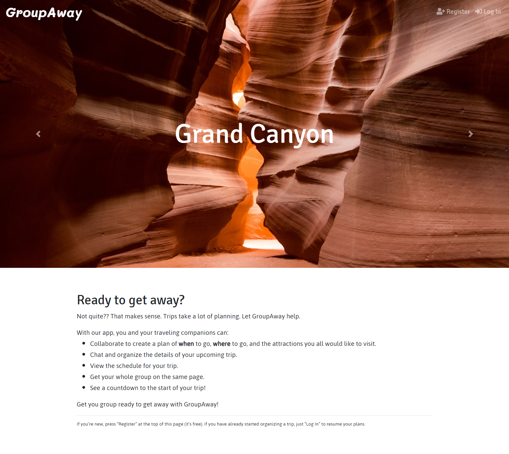

Click on the "Register" button in the nav bar and go to the registration form to set up an account. Enter a username and password (at least 6 characters), and confirm the password. Then click "Sign Up". 

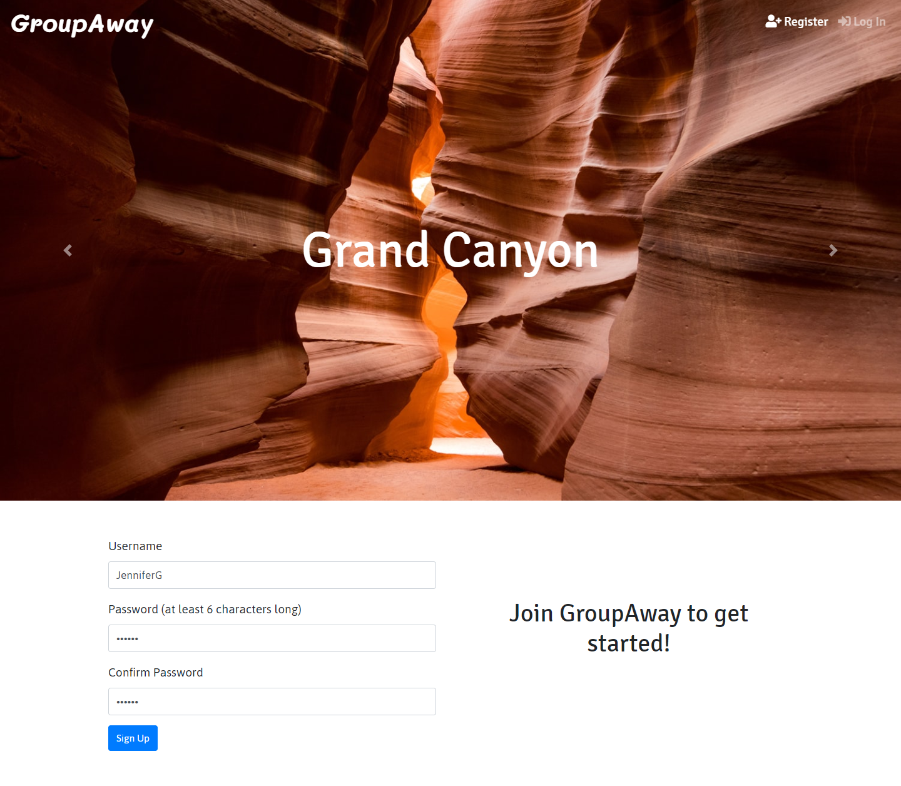

This form has validation, so the username must be unique and the password must be at least 6 characters and the two password fields must match.

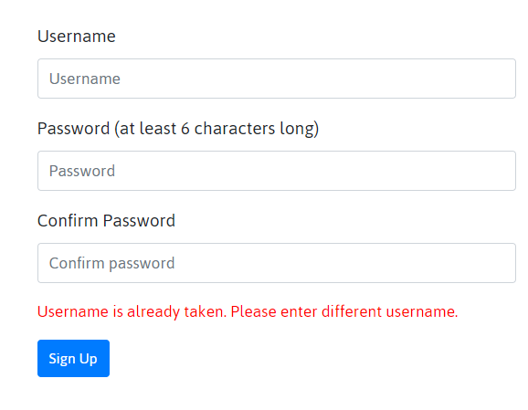

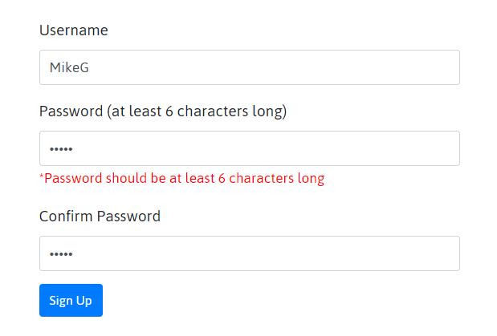

If you already have registered with GroupAway, then click on "Log In" button in the navbar, and in the form enter your username and password. 

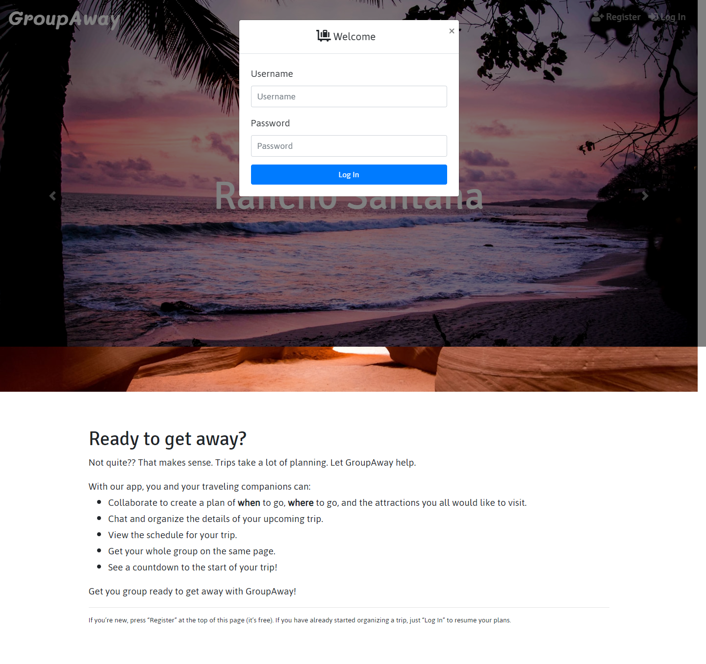

If the credentials are not entered correctly for an existing username or password or a user has not registered before this session, the form shows an error message.

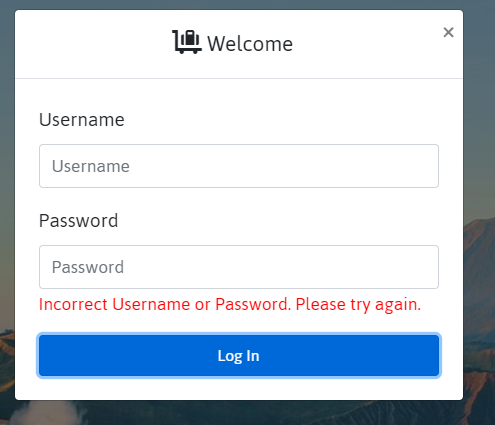

Once registered and/or logged in, the profile page opens. On the profile page, you will see a welcome with your username, a paragraph with instructions, and a trip calendar. The nav bar changes to include buttons at the top right for "Calendar", "Location", "Chat", and "Log Out".

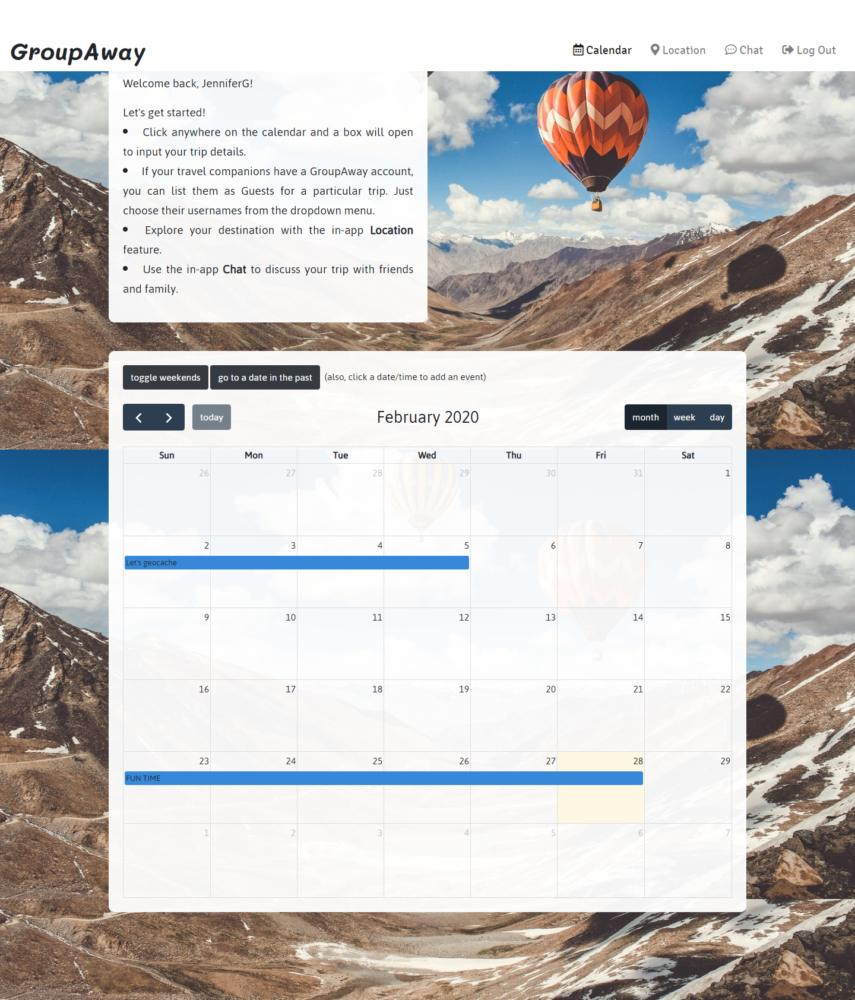

When you click on the calendar toward the bottom of the page, a modal opens to enter the name of a trip, the start and end dates, and a description. It also allows you to add multiple users (users who also have registered with GroupAway) as Guests to a trip.

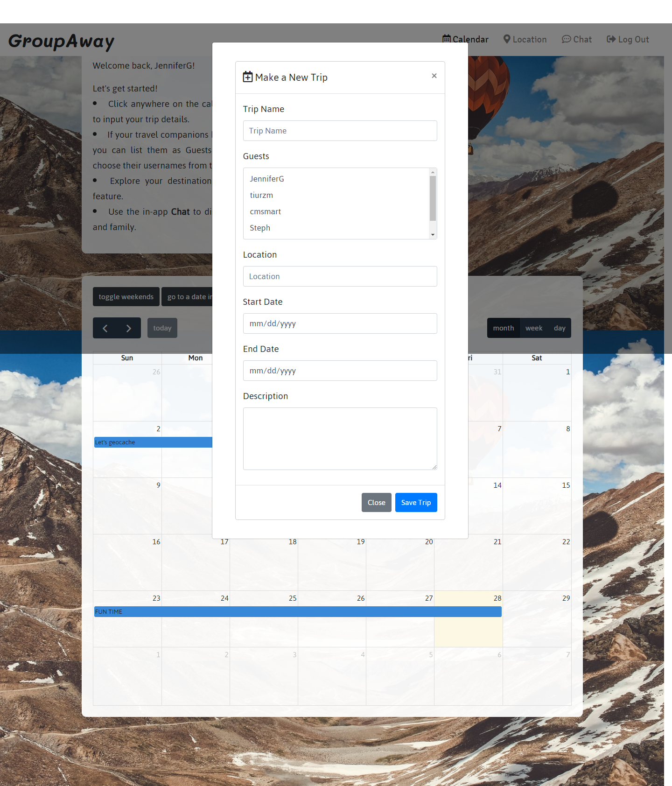

This form also has validation.

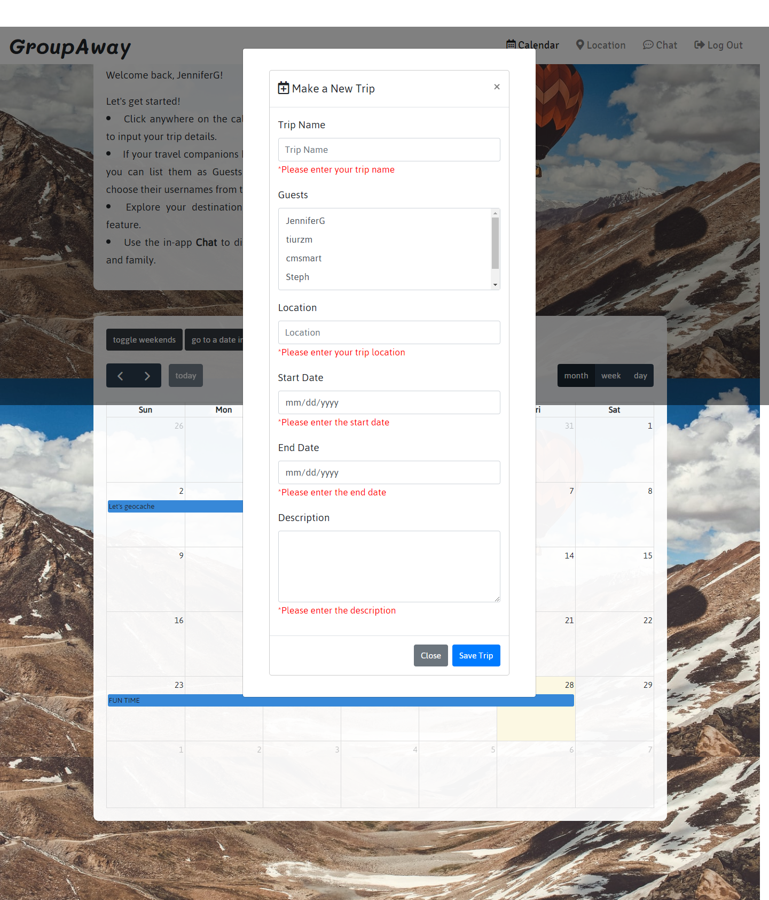

Once the details are entered and the "Save Trip" button is pressed, the trip will be saved and appear on the calendars of the user and all the Guests of a trip.

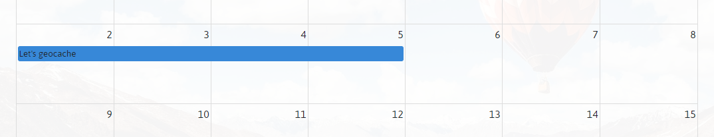

If the user clicks on the trip on the calendar, an Edit Your Trip modal opens and allows the user to change details and update or delete the trip. 

In this modal, each saved trip has a countdown to the start date of the trip.

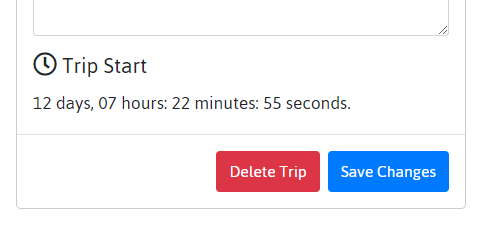

Pressing the "Location" button in the nav bar opens a page with a map where you can enter a destination and explore the map. There are options for viewing either a Map or Satellite view and Full Screen view.

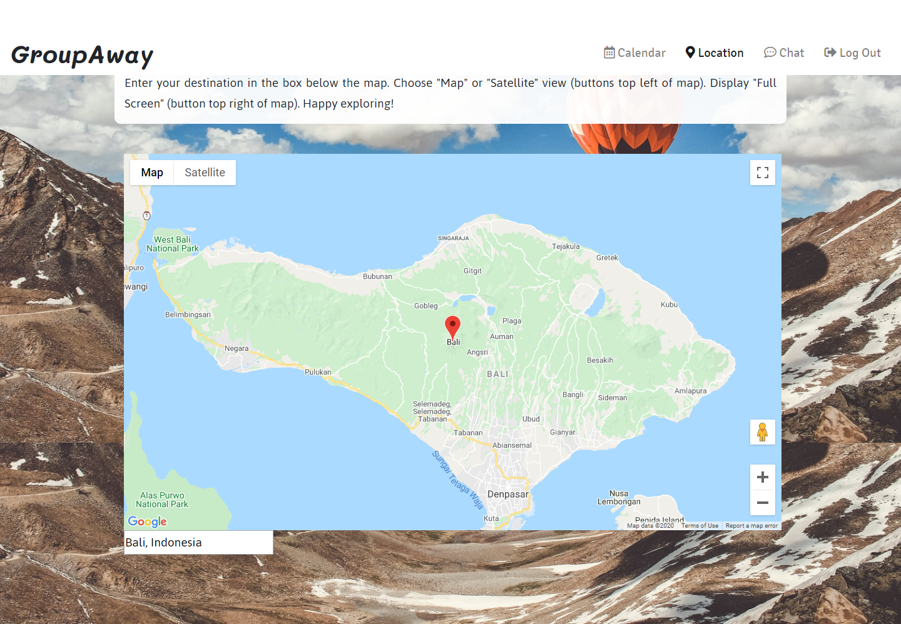

Pressing the "Chat" button in the nav bar opens a form to enter a chat name.

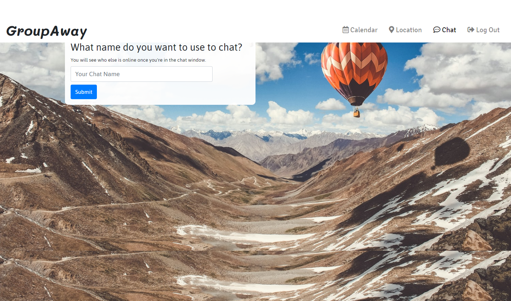

Once the chat window opens, the user will see a Who's Online list to the left. Blue dots by the chat names indicate who is online. To the right is a large message screen that displays the last 100 messages. (These are stored on the backend with Pusher's Chatkit.) At the bottom is a field for typing a message and then pressing Enter. There is a typing indicator that appears above this field if another user is typing at the moment. 

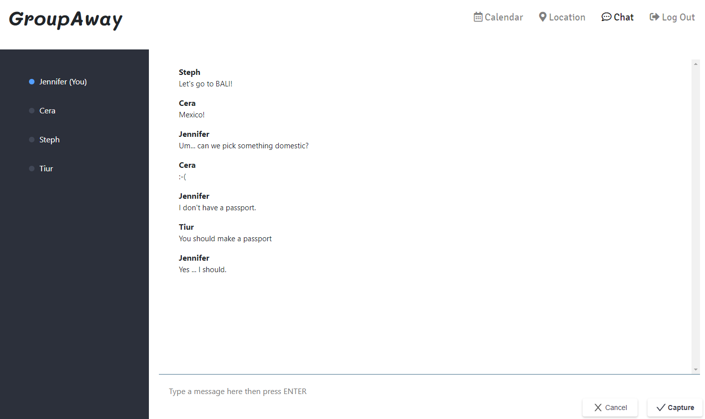

And finally, this 404 page will display if the page the user requested is not found.

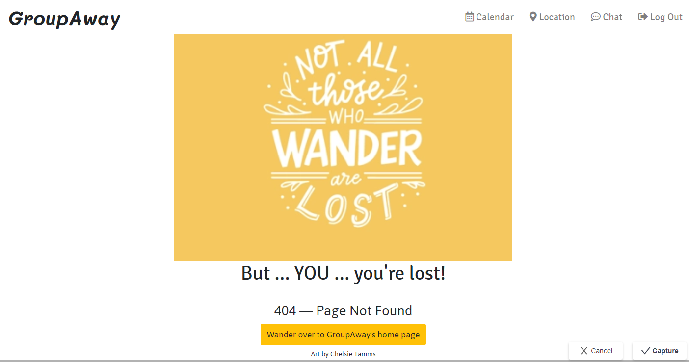

*****************************************************

<strong>To create the app from the files in our team's GitHub repository:</strong> 

This project was bootstrapped with [Create React App](https://github.com/facebookincubator/create-react-app).(The second README file in the Client folder of this project has further details.)

To begin from our project folder, first clone the GitHub repository. You will need to have installed:

* Node

* Mongo database, Mongod, and mongoose (to run the app locally, you will need to start and have Mongod running in the background)

* And these dependencies:

    * @fullcalendar/core: 4.3.1
    * @fullcalendar/daygrid: 4.3.0
    * @fullcalendar/interaction: 4.3.0
    * @fullcalendar/moment-timezone: 4.4.0
    * @fullcalendar/react: 4.3.0
    * @fullcalendar/timegrid: 4.3.0
    * @pusher/chatkit-client: 1.13.4
    * @pusher/chatkit-server: 2.4.0
    * axios: 0.19.2
    * bcrypt-nodejs: "0.0.3
    * body-parser: 1.19.0
    * cookie-parser: 1.4.4
    * cors: 2.8.5
    * date-fns: 2.10.0
    * dotenv: 8.2.0
    * express: 4.17.1
    * express-flash-messages: 0.1.1
    * express-session: 1.17.0
    * helmet: 3.21.2
    * if-env: 1.0.4
    * local-storage: 2.0.0
    * moment: 2.24.0
    * moment-timezone: 0.5.27
    * mongodb: 3.5.3
    * mongoose: 5.8.11
    * node-sass: 4.13.1
    * passport: 0.4.1
    * passport-local: 1.0.0
    * passport-local-mongoose: 6.0.1
    * passport-session: 1.0.2
    * react-bootstrap: 1.0.0-beta.16
    * react-google-maps: 9.4.5
    * react-places-autocomplete: 7.2.1

You will need to have a Google API key for the map display and a Pusher's Chatkit account to obtain credentials for the chat instance locator, secret key, and chat room ID.

Before running the server.js file using node.js, run "npm install" to download and install the dependencies defined in the package.json. 

Then run the script "npm start" at the command line to begin the server, and then navigate to localhost:3000 in your browser to see the HTML home page and proceed from there.

### Why the Project is Useful ### 

The app fulfilled a project assignment for University of Kansas Coding Boot Camp, August 2019 to February 2020. It provided us with the opportunity to work more with the following technologies:

* Mongo database, Mongod, and mongoose
* Express web server
* React
* Node web server
* Passport.js
* FullCalendar API
* Google Maps API
* Pusher's Chatkit (for backend chat handling)
* Moment.js
* Bootstrap 4.0 frontend framework
* Heroku for deployment
* mLab add-on for cloud-based Mongo database
* HTML5
* CSS
* JavaScript
* Favicon & App Icon Generator
* Git version-control system
* Slack messaging platform

### Who Maintains and Contributes to the Project ###

  The team members who created the GroupAway app are Tiur Mawaddah, Stephanie Truong, Cera Smart, and Jennifer Gaumnitz.

### Where Users Can Get Help with This Project ###

  Questions? Contact Jennifer Gaumnitz at jlgaumnitz@gmail.com
